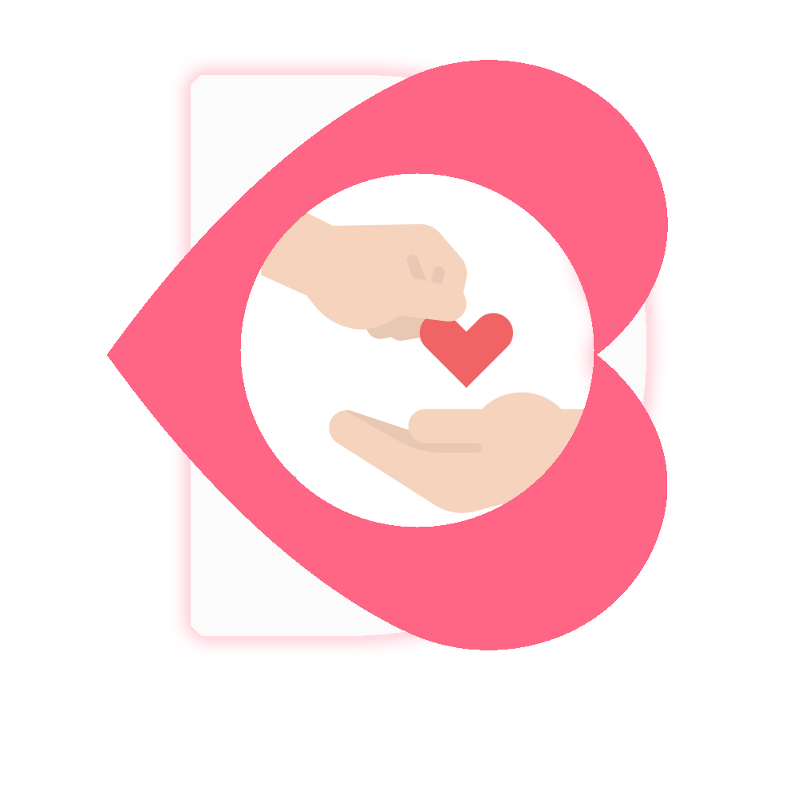
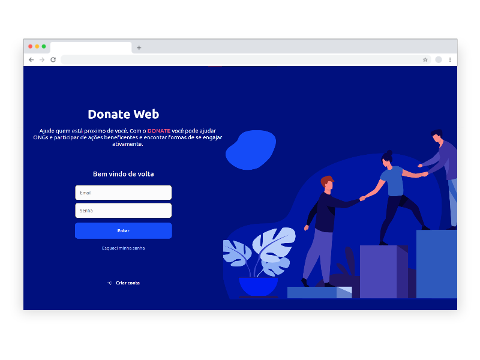
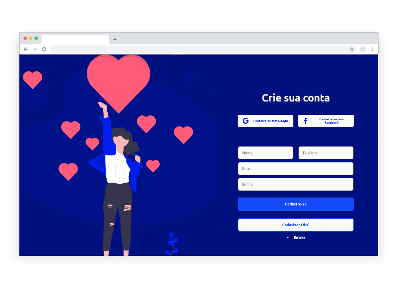

<h1 align="center">
    
     
    Donate Web
</h1>

<h4 align="center">
  Pagina web pra divulgação de ONGs e Campanhas solidarias
</h4>

  

  

  

  
  <a href="https://github.com/fdAssis/Donate-web/commits/master">
    

  <a href="#rocket-technologies">Technologies</a>&nbsp;&nbsp;&nbsp;|&nbsp;&nbsp;&nbsp;
  <a href="#information_source-how-to-use">How To Use</a>&nbsp;&nbsp;&nbsp;|&nbsp;&nbsp;&nbsp;
  <a href="#memo-license">License</a>

  

  

